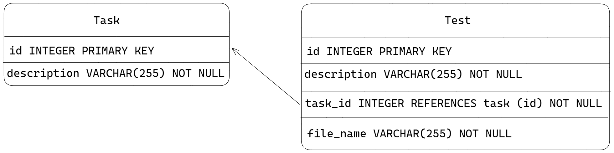

# Server side application

Application is written in python using [Flask](https://flask.palletsprojects.com/en/3.0.x) framework.

Flask framework was chosen becaus of the ready to use python LTI protocol implementation, that supports Django, and Flask.
Django for this purposes was way too complicated, so Flask was chosen.

## app.py

app.py - is the main file of the program, it contains all endpoints and database structures. It has pretty dummy structure
but the first target was to implement working prototype, and other generations of students could refactor it :).

## app setup

In the `configs` directory of the server you can find next files

* lti.json - is used for the lti protocol and has set of configurations for the different platforms
* public.jwk.json - is used for jwt token verification [READ MORE HERE](https://auth0.com/docs/secure/tokens/json-web-tokens/json-web-key-sets)
* public keys - is used for token verification
* private keys is used for token signing
* TODO: write cert_suite_private usage, don't remember for the moment it's usage

## Database Models

Database has two entities:
 * Task - representing particular task that needs to be done created by teacher.
 * Test - tests that used to verify `Task` completion.

For visual understanding - here is the diagram

